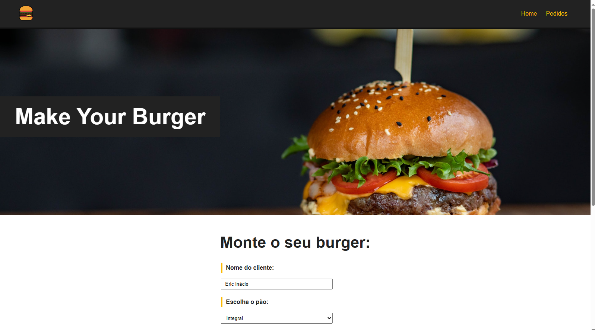

  

# CURSO DE VUE 3
Este curso de Vue.js é ministrado por **[Matheus Battisti](https://github.com/matheusbattisti)**, um experiente Desenvolvedor Fullstack e criador do Canal Hora de Codar. Estou dedicando tempo para estudar e praticar este curso, visando aprimorar minha expertise no desenvolvimento front-end com o framework Vue.js.

## SKILLS ADQUIRIDAS
- **[VUE.js](https://vuejs.org/guide/introduction.html)**